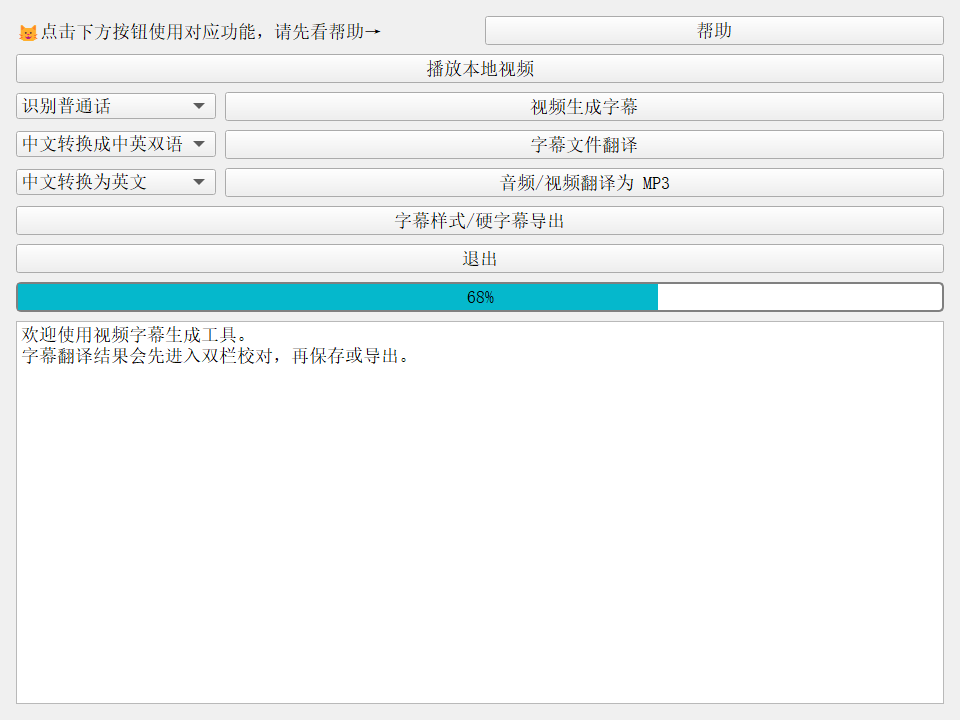
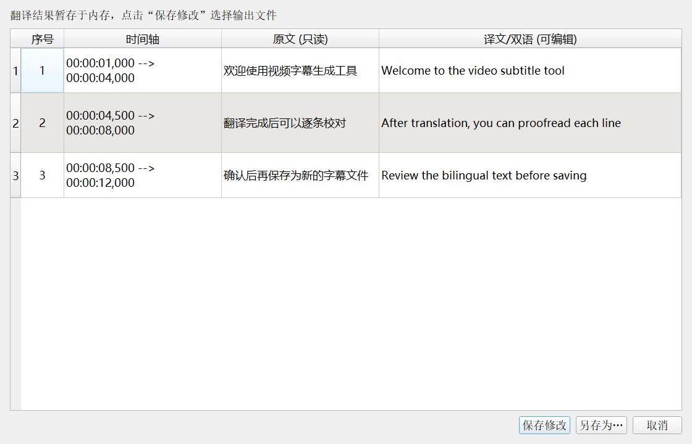
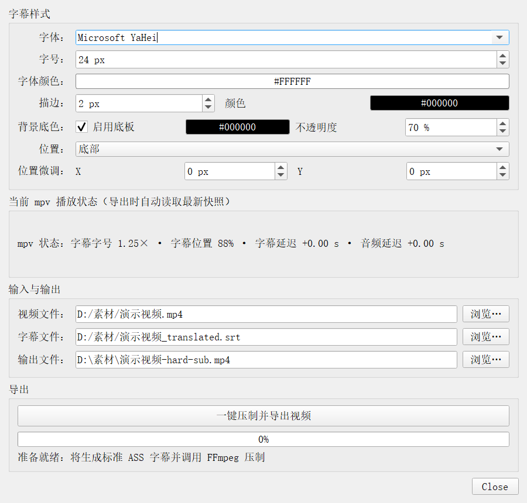

# 视频字幕生成工具

这是一个基于 PyQt5 的桌面视频字幕工具，整合百度语音识别、百度机器翻译、百度语音合成、便携版 mpv 和 FFmpeg。它支持从视频生成 SRT 字幕、翻译字幕并人工校对，也可以把样式化字幕直接压制到视频中，或把音频/视频翻译成 MP3。

项目面向 Windows 桌面使用，仓库已经附带便携版 `mpv` 和 FFmpeg。字幕翻译、语音识别、语音合成需要网络连接和对应的百度 API 密钥。

## 功能概览

### 视频生成字幕

- 调用百度语音识别，将视频中的语音转换为字幕。
- 支持普通话和英语识别。
- 在后台线程执行，主界面显示处理进度，不会因识别过程卡死。
- 默认在视频旁边生成同名 `.srt` 文件。

### 字幕文件翻译

主界面的字幕翻译下拉框提供四种方向：

- 中文转换成中英双语
- 英文转换成中英双语
- 中文转换成英文
- 英文转换成中文

翻译流程采用内存级人机协同：

1. 后台线程读取源 SRT 并调用百度机器翻译。
2. 翻译结果暂存在内存中，不会立即创建翻译文件。
3. 翻译完成后自动打开双栏校对窗口。
4. 用户点击保存或另存为后，才把最终内容写入 SRT；关闭或取消窗口会丢弃未确认的结果。

默认保存名为 `原文件名_translated.srt`。

### 双栏字幕校对编辑器

校对窗口的表格结构为：

```text
序号 | 时间轴 | 原文（只读） | 译文/双语（可编辑）
```

- 序号、时间轴和原文列只读，避免误改参考内容。
- 译文/双语列支持双击编辑和多行文本，适合处理中英双语字幕。
- 保存时只读取第四列，并按原序号和时间轴重新写成标准 SRT。
- 同时兼容从内存传入的翻译记录和直接打开本地 SRT 文件。
- 支持 UTF-8、UTF-8 BOM、GB18030 等常见字幕编码，并对格式错误显示友好提示。
- 编辑器委托器已修复多行编辑崩溃问题，使用 `option.rect.height()` 获取单元格高度。

内存翻译记录使用以下字段：

```python
{
    "index": 1,
    "time": "00:00:01,000 --> 00:00:04,000",
    "original_text": "原文",
    "translated_text": "译文或中英双语文本",
}
```

### 音频/视频翻译为 MP3

主界面的 **音频/视频翻译为 MP3** 使用左侧下拉框选择方向：

- 中文转换为英文
- 英文转换成中文

处理链路为百度语音识别 → 百度机器翻译 → 百度语音合成 → 分段合并和时长匹配。支持以下输入格式：

```text
mp3, wav, m4a, aac, flac, ogg,
mp4, mkv, mov, avi, webm
```

输出文件通常保存为：

```text
原文件名-en.mp3
原文件名-zh.mp3
```

转换过程在后台线程运行并报告阶段进度。

### 字幕样式与硬字幕导出

点击 **字幕样式/硬字幕导出** 可以配置：

- 系统字体、字号和字体颜色
- 描边粗细与描边颜色
- 是否启用背景底板、底板颜色和透明度
- 顶部/居中/底部位置以及 X/Y 偏移
- 输出视频和字幕文件路径

导出流程会先把 SRT 转换为标准 ASS，再调用 FFmpeg 进行硬字幕压制：

- ASS 头部明确写入真实视频的 `PlayResX` 和 `PlayResY`。
- 样式写入 `[V4+ Styles]`，使用 ASS 的 `&HAABBGGRR&` 颜色格式和 `Alignment=2` 底部居中对齐。
- 字号、描边和垂直边距根据视频分辨率缩放。SRT/libass 的虚拟画布基准为 `288`，核心计算为：

  ```text
  scale_factor = video_height / 288.0
  final_fontsize = base_fontsize * sub_scale * scale_factor
  final_outline = outline_width * scale_factor
  final_margin_v = margin_v * scale_factor
  ```

- `ffmpeg_worker.py` 使用 `QThread` 执行压制，实时解析 FFmpeg 的时间进度并更新进度条，主界面保持响应。

### mpv 状态同步与一键导出

- 项目内置便携版 mpv：`mpv/mpv.exe`。
- Python 通过 JSON IPC 监听并保存 `sub-delay`、`audio-delay`、`sub-scale` 和 `sub-pos`。
- 关闭播放器前会同步最后一次属性，并保存到 `mpv/portable_config/persistent_config.json`。
- mpv 右键菜单由 `mpv/portable_config/scripts/uosc.lua` 扩展，包含音频延迟、字幕延迟、字幕字号、字幕位置和 **一键渲染导出视频**。
- 右键菜单触发 `script-message export-video-now` 后，Python 会在播放器内显示“开始压制导出视频，请稍候…”，再读取最新 mpv 状态和主界面样式配置，生成一次完整导出快照并启动 FFmpeg。

这样可以让播放器预览中的字号、位置和延迟尽量与最终硬字幕成片保持一致。

## 环境与安装

建议使用 Python 3.10 或更高版本。项目依赖位于 `requirements.txt`：

```text
PyQt5>=5.15.11,<6
requests>=2.32,<3
pysrt>=1.1.2,<2
```

在项目目录中执行：

```powershell
python -m venv .venv
.\.venv\Scripts\Activate.ps1
pip install -r requirements.txt
```

仓库已附带以下工具：

```text
mpv/mpv.exe
ffmpeg-6.0-essentials_build/bin/ffmpeg.exe
ffmpeg-6.0-essentials_build/bin/ffprobe.exe
```

如果本地没有可用的打包工具，字幕导出也会尝试使用系统 `PATH` 中的 `ffmpeg`/`ffprobe`。

## 百度 API 配置

首次使用时，程序会在界面中提示输入密钥，也可以在项目目录手动创建以下文件。

语音识别和语音合成使用 `apikey.txt`：

```text
API_KEY = '你的百度语音 API_KEY'
SECRET_KEY = '你的百度语音 SECRET_KEY'
```

机器翻译使用 `translationkey.txt`：

```text
AK = '你的百度翻译 AK'
SK = '你的百度翻译 SK'
```

请在百度智能云控制台创建语音技术和机器翻译应用，并确认应用拥有对应接口权限。两个密钥文件已经加入 `.gitignore`，不要把真实密钥提交到仓库或公开分享。

## 启动

请从包含 `main.py`、`mpv/` 和 `ffmpeg-6.0-essentials_build/` 的项目目录启动：

```powershell
cd E:\Video_to_Srt\Video_to_Srt
.\.venv\Scripts\Activate.ps1
python main.py
```

基本使用顺序：

1. 点击 **视频生成字幕**，选择识别语言和视频。
2. 如需翻译，点击 **字幕文件翻译**，选择翻译方向和源 SRT。
3. 在自动打开的校对窗口检查原文与译文，确认后点击 **保存修改** 或 **另存为…**。
4. 点击 **字幕样式/硬字幕导出** 设置样式并选择输出路径。
5. 也可以先点击 **播放本地视频**，在 mpv 右键菜单中调整字幕参数后直接选择 **一键渲染导出视频**。
6. 需要语音翻译时，选择 **音频/视频翻译为 MP3** 和语言方向，再选择媒体文件。

## 项目结构

```text
main.py                         PyQt5 主窗口与业务流程
subtitle_editor_dialog.py       SRT 解析、双栏校对和保存
subtitle_style_dialog.py        字幕样式配置面板
subtitle_export.py              ASS 生成、FFmpeg 命令和导出快照
ffmpeg_worker.py                FFmpeg 压制 QThread 与进度解析
playback_state.py               mpv 状态数据类、IPC 和持久化
mpv_controller.py               便携版 mpv 生命周期与事件桥接
audio_translation.py            媒体转 MP3 的识别、翻译和合成流程
translation.py                  百度机器翻译接口
videotosrt.py                   百度语音识别和音频预处理
mpv/portable_config/            mpv 配置、输入映射、uosc 菜单脚本
ffmpeg-6.0-essentials_build/    随项目提供的 FFmpeg/FFprobe
icon/                           界面截图和图标
tests/                          自动化测试
```

## 测试

在已安装依赖的环境中运行：

```powershell
$env:QT_QPA_PLATFORM = 'offscreen'
python -m pytest -q
```

当前测试覆盖 SRT 解析与序列化、双栏编辑器数据流、ASS 颜色与分辨率缩放、FFmpeg 命令构建、播放状态合并、音频延迟映射和 mpv IPC 边界行为。

## 注意事项

- 翻译和语音服务需要联网；百度 API 的额度、权限或网络异常会在界面中提示。
- 硬字幕导出会重新编码视频，耗时取决于视频分辨率和时长；音频通常使用复制或延迟滤镜处理。
- mpv 右键导出需要播放器仍在运行，并且主程序能够找到当前视频和对应字幕文件。
- `mpv/portable_config/persistent_config.json` 是本机播放状态文件，通常只保留本地修改，不要把个人状态当作功能代码提交。
- 如果播放器无法启动，请确认 `mpv/mpv.exe` 存在；如果导出失败，请检查 FFmpeg/FFprobe 文件和输入视频、字幕路径。

## 界面截图








